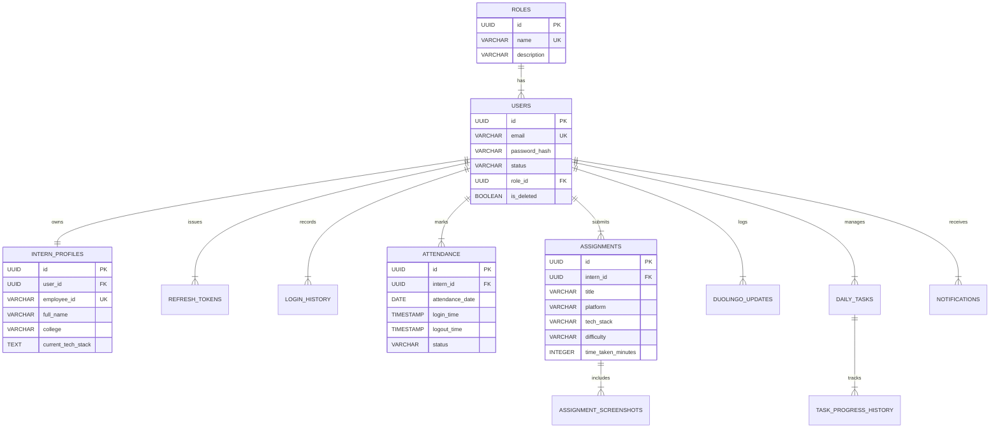
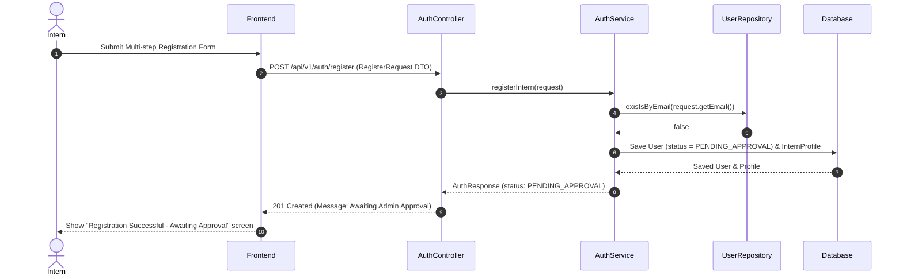

# Enterprise Intern Management Portal — Technical Architecture

This document details the architectural specifications, entity-relationship models, sequence diagrams, and REST API contracts for the Intern Management Portal.

---

## 1. System Architecture & Layered Design

The system employs a multi-tiered Clean Architecture separating UI presentation, network ingress/egress, business transaction orchestration, and data persistence.

```
+-----------------------------------------------------------------------------+
|                          React + TypeScript Frontend                        |
|   (Vite, Tailwind CSS, shadcn/ui, TanStack Query, React Hook Form, Zod)      |
+-----------------------------------------------------------------------------+
                                      │
                                      │ HTTP / REST / JWT Bearer
                                      ▼
+-----------------------------------------------------------------------------+
|                       Spring Boot 3 Backend Application                     |
|                                                                             |
|  +-----------------------------------------------------------------------+  |
|  | Spring Security Filter Chain (CORS, Rate Limiting, JwtAuthFilter)     |  |
|  +-----------------------------------------------------------------------+  |
|                                     │                                       |
|                                     ▼                                       |
|  +-----------------------------------------------------------------------+  |
|  | Controller Layer (@RestController, @Valid, OpenAPI Swagger Docs)      |  |
|  +-----------------------------------------------------------------------+  |
|                                     │ MapStruct DTO Mapping                 |
|                                     ▼                                       |
|  +-----------------------------------------------------------------------+  |
|  | Service Layer (@Transactional Business Logic, Security Validation)    |  |
|  +-----------------------------------------------------------------------+  |
|                                     │                                       |
|                                     ▼                                       |
|  +-----------------------------------------------------------------------+  |
|  | Repository Layer (Spring Data JPA Repositories & Specifications)      |  |
|  +-----------------------------------------------------------------------+  |
+-----------------------------------------------------------------------------+
                                      │
                                      ▼
+-----------------------------------------------------------------------------+
|                        PostgreSQL 3NF Database                              |
+-----------------------------------------------------------------------------+
```

---

## 2. Entity-Relationship (ER) Diagram



---

## 3. Authentication & Registration Sequence Diagram



---

## 4. REST API Specification

### Authentication Endpoints (`/api/v1/auth`)
- `POST /register`: Register new intern account (Returns status `PENDING_APPROVAL`).
- `POST /login`: Authenticate with email/password. Returns JWT Access Token + Refresh Token if `ACTIVE`.
- `POST /refresh-token`: Exchange valid refresh token for a new access token.

### Admin Endpoints (`/api/v1/admin`)
- `GET /interns`: Paginated & filtered list of interns (Filter by status, college, tech stack, search keyword).
- `PATCH /interns/{id}/approve`: Approve a `PENDING_APPROVAL` intern account.
- `PATCH /interns/{id}/reject`: Reject an intern registration request.
- `PATCH /interns/{id}/disable`: Disable an active intern account.
- `GET /analytics/dashboard`: Fetch comprehensive dashboard metrics (total learning hours, attendance trends, tech stack breakdown).

### Intern Endpoints (`/api/v1/intern`)
- `GET /profile/me`: Retrieve current logged-in intern's full profile and stats.
- `PUT /profile/me`: Update profile details (skills, GitHub, LinkedIn).
- `POST /attendance/check-in`: Mark daily login time.
- `POST /attendance/check-out`: Mark daily logout time.
- `GET /attendance`: Fetch filtered attendance history.
- `POST /assignments`: Submit solved coding problem with screenshot upload.
- `GET /assignments`: Fetch personal problem solving history.
- `POST /duolingo`: Update daily streak, XP, language, and proof screenshot.
- `GET /duolingo/streak`: Get current & longest streak summary.
- `POST /tasks`: Create a daily task.
- `PATCH /tasks/{id}/progress`: Update progress percentage (0-100%) and status (`PENDING`, `IN_PROGRESS`, `COMPLETED`).
